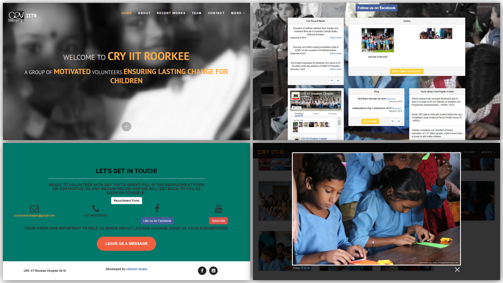
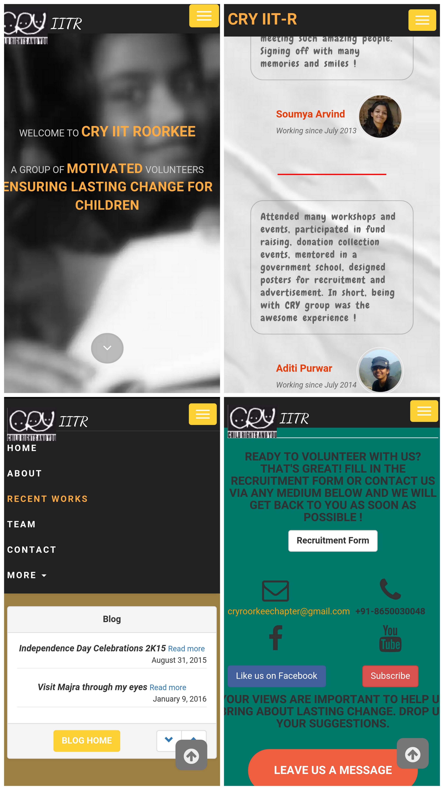

cry-iitr-website
======
## Synopsis
This is a website for an organisation - more suitably an NGO working for child rights.
## Code Result
A complete website hosted on www.cryiitr.com
## Motivation
The motivation behind this project is self explanatory-supporting child rights by spreading awareness through the Internet, by using technology for a social cause.
## Installation
No installation required.

Unzip the downloaded folder and run "index.html".
## API Reference
* Highly modified [Agency](https://github.com/BlackrockDigital/startbootstrap-agency "Agency Github")
* [Lightbox2](https://github.com/lokesh/lightbox2)
* [Bootstrap Newsbox](http://www.jqueryscript.net/slider/Responsive-jQuery-News-Ticker-Plugin-with-Bootstrap-3-Bootstrap-News-Box.html)

## Snapshots
##### Desktop View

##### Mobile View

## Creator
* [About Me : Utkarsh](https://about.me/UtkarshGpta)
* [Twitter : Utkarsh](https://twitter.com/UtkarshGpta)

## Testing
You can view the website either at www.cryiitr.com or [Github Pages](http://utkarshgpta.github.io/cry-iitr-website)

## License
The content of this project itself is licensed under the [Creative Commons Attribution 3.0 license](http://creativecommons.org/licenses/by/3.0/us/deed.en_US), and the underlying source code used to format and display that content is licensed under the [MIT license](http://opensource.org/licenses/mit-license.php).